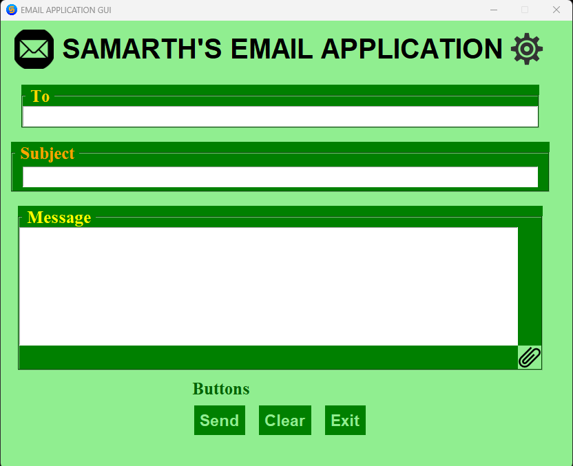

## 
***Introducing New Samarth's Project - Mail Application with GUI***

---

---
### 
💡 ***This a Basic Project in Python*** 💡

### ➡️ **<u>Features are:-</u>**

- #### ***_Email sending_*** 
- #### ***_Saving your email's password_*** 
- #### ***_Attachments_*** 

---

### ⚒️ **<u>Python Module Used Here:-</u>** 
- #### ***_Tkinter_***
- #### ***_os_***
- #### ***_Tkinter filedialog_***
- #### ***_imghdr_***
- #### ***_smtplib_***
- #### ***_email.message_***
- #### ***_Tkinter messagebox_***

---

## 
***YouTude Video : https://youtu.be/AcaJ9LWZSFs***

